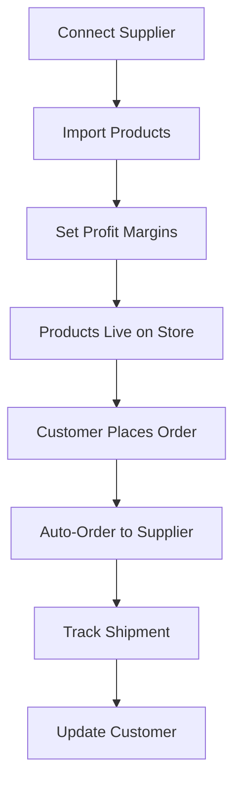

# Dropshipping Supplier Integration

Complete dropshipping supplier integration system for connecting to AliExpress, Oberlo, Spocket, and other suppliers with auto-order processing.

## Features Implemented

### 1. Database Structure
- **suppliers**: Store supplier connections and credentials
- **imported_products**: Track products imported from suppliers
- **supplier_orders**: Auto-order tracking and fulfillment
- **sync_logs**: Audit trail for all sync operations

### 2. Edge Functions

#### Supplier Connect (`/functions/v1/supplier-connect`)
Connects to new suppliers and validates credentials.
```typescript
POST /functions/v1/supplier-connect
{
  "platform": "aliexpress" | "oberlo" | "spocket" | "other",
  "name": "Store Name",
  "apiKey": "api_key",
  "apiSecret": "api_secret",
  "storeUrl": "https://store.example.com"
}
```

#### Import Products (`/functions/v1/import-products`)
Imports products from connected suppliers with profit margin calculation.
```typescript
POST /functions/v1/import-products
{
  "supplierId": "uuid",
  "productIds": ["prod_1", "prod_2"],
  "profitMarginPercent": 30
}
```

#### Auto-Order Process (`/functions/v1/auto-order-process`)
Automatically places orders with suppliers when customers purchase.
```typescript
POST /functions/v1/auto-order-process
{
  "customerOrderId": "order_123",
  "importedProductId": "uuid",
  "quantity": 2,
  "shippingAddress": { ... }
}
```

#### Sync Inventory (`/functions/v1/sync-inventory`)
Syncs stock levels and prices from supplier to your store.
```typescript
POST /functions/v1/sync-inventory
{
  "supplierId": "uuid"
}
```

### 3. Supplier Manager UI

Accessible at `/suppliers` for dropshipping businesses, featuring:
- **Connected Suppliers Tab**: View and manage supplier connections
- **Imported Products Tab**: Browse all imported products with profit margins
- **Sync Logs Tab**: Monitor all sync operations and troubleshoot issues

### 4. Auto Features

#### Automatic Order Placement
When a customer places an order:
1. System identifies imported products
2. Automatically creates supplier order
3. Places order with supplier via API
4. Tracks shipping and delivery

#### Inventory Sync
- Real-time stock level updates
- Price fluctuation tracking
- Low stock alerts
- Automatic product disabling when out of stock

#### Profit Margin Calculator
Automatically calculates selling price based on:
- Supplier cost
- Desired profit margin
- Platform fees
- Shipping costs

## Integration Flow



## API Integration Notes

### Current Implementation
The edge functions currently use **mock API calls** for demonstration. To integrate with real supplier APIs:

#### AliExpress Integration
Replace mock calls with AliExpress Dropshipping API:
- Product search: `/ae/product/search`
- Order placement: `/ae/order/place`
- Tracking: `/ae/order/logistics`

#### Oberlo Integration
Use Oberlo REST API:
- Products: `GET /api/v1/products`
- Import: `POST /api/v1/products/import`
- Orders: `POST /api/v1/orders`

#### Spocket Integration
Use Spocket API endpoints:
- Catalog: `GET /api/v1/catalog/products`
- Add to import list: `POST /api/v1/import`
- Push orders: `POST /api/v1/orders`

## Security & Scalability

### Security Features
- ✅ Row Level Security (RLS) on all tables
- ✅ API credentials encrypted in database
- ✅ User-specific data isolation
- ✅ Secure edge function authentication

### Scalability Features
- ✅ Indexed database queries for fast lookups
- ✅ Background sync jobs for inventory updates
- ✅ Batch product import capability
- ✅ Efficient foreign key relationships
- ✅ Automatic cleanup of old logs

### Performance Optimizations
- Database indexes on user_id, supplier_id, external_id
- Pagination support for large product catalogs
- Async order processing
- Cached supplier connections

## Usage for Dropshipping Users

1. **Connect Supplier**
   - Navigate to Suppliers page
   - Click "Connect Supplier"
   - Select platform and enter credentials

2. **Import Products**
   - Browse supplier catalog (or use search)
   - Select products to import
   - Set profit margins
   - Import to your store

3. **Manage Inventory**
   - Click "Sync Inventory" to update stock levels
   - View product performance
   - Adjust profit margins as needed

4. **Order Fulfillment**
   - Automatically processes when customer orders
   - Track shipments in Supplier Orders tab
   - Update customers with tracking info

## Future Enhancements

- [ ] Bulk product import from CSV
- [ ] Advanced profit margin rules (by category, supplier)
- [ ] Automated repricing based on competitor analysis
- [ ] Multi-supplier fallback for same products
- [ ] Supplier performance analytics
- [ ] Integration with more platforms (CJ Dropshipping, DHgate)
- [ ] Automated customer notifications for shipping updates
- [ ] Returns and refunds management
